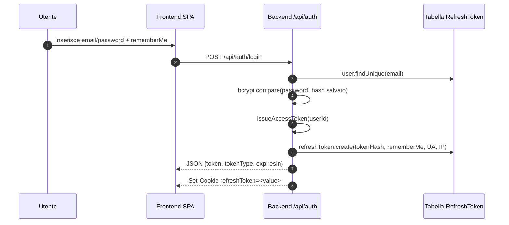
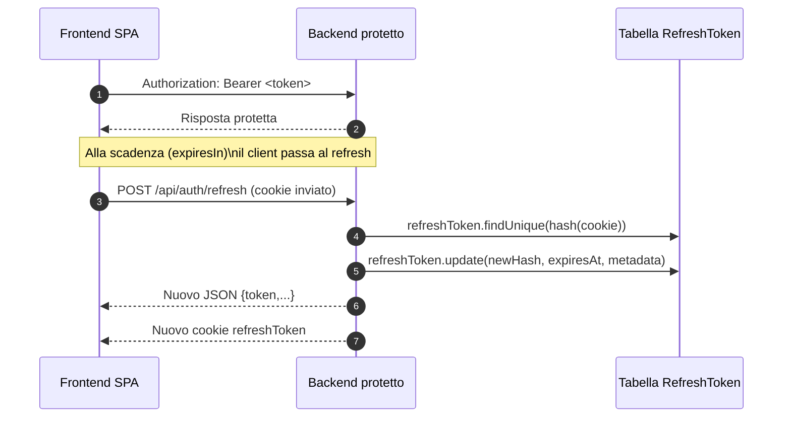
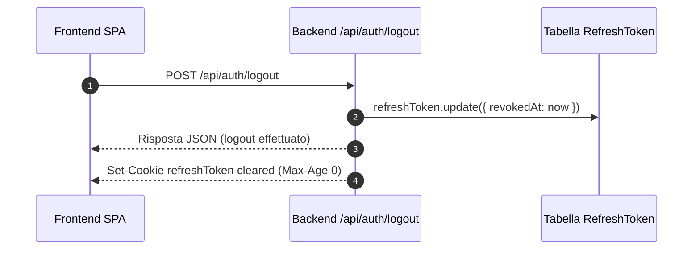

# Flusso di login, Bearer token e refresh cookie

## Visione d'insieme
- Il client invia le credenziali a `POST /api/auth/login` insieme all'opzione `rememberMe`.
- Il controller (`controllers/auth.controller.js`) verifica utente e password, controlla che l'email sia verificata e genera **due artefatti**: un access token JWT e un refresh token casuale.
- L'access token viene restituito nel body JSON (`token`, `tokenType: "Bearer"`, `expiresIn`), da usare nell'header `Authorization: Bearer <token>` per tutte le API protette.
- Il refresh token viene salvato **solo come hash** in tabella `RefreshToken` (via Prisma) e il valore originale è inviato come cookie HTTP-only al browser; il cookie serve agli endpoint `/api/auth/refresh` e `/api/auth/logout`.
- Quando l'access token scade, il client chiama `/api/auth/refresh`: il backend leggere il cookie, valida e ruota il refresh token, emettendo un nuovo JWT e un nuovo cookie. Il logout revoca e cancella il cookie (rotazione forzata).

## Diagrammi

### 1. Login e rilascio dei token

### 2. Utilizzo del Bearer e refresh periodico

### 3. Logout e revoca

## Dettaglio degli artefatti

### Access/Bearer token
- Creato da `issueAccessToken(userId)` con `jsonwebtoken`.
- Payload minimale `{ userId }`, firmato con `JWT_SECRET`.
- Scadenza configurabile tramite `ACCESS_TOKEN_EXPIRATION` (default `24h`): dopo tale periodo è necessario un refresh.
- Trasporto: header `Authorization: Bearer <token>`.

### Refresh token e cookie

| Elemento | Valore / origine | Note |
| --- | --- | --- |
| Nome cookie | `REFRESH_COOKIE_NAME` (default `refreshToken`) | impostato in `login` e `refreshSession`. |
| Valore | stringa hex da `crypto.randomBytes(64)` (128 caratteri) | **Non** memorizzato in chiaro: nel DB viene salvato `sha256(value)`. |
| Path | `REFRESH_COOKIE_PATH` (default `/api/auth`) | Limita l'invio del cookie alle rotte auth. |
| Dominio | `REFRESH_COOKIE_DOMAIN` (opzionale) | Solo se configurato. |
| `httpOnly` | sempre `true` | Mitiga XSS: il JS del browser non può leggere il cookie. |
| `secure` | `true` in produzione o se `REFRESH_COOKIE_SECURE="true"` | Obbligatorio se `SameSite=None`. |
| `sameSite` | `REFRESH_COOKIE_SAMESITE` (`lax` di default) | `none`, `lax` o `strict`. |
| `maxAge` | dipende da `rememberMe` | `REFRESH_TOKEN_TTL_HOURS` (default 24h) oppure `REFRESH_TOKEN_REMEMBER_TTL_DAYS` (default 30 giorni). |
| Metadata | `userAgent` (255 char) e `ipAddress` (45 char) | Salvati nel record `RefreshToken` per auditing. |

### Rotazione e revoca
- Ogni chiamata a `/api/auth/refresh` copia `rememberMe` dal record, genera un nuovo token, aggiorna hash e scadenza e restituisce nuovo cookie + bearer.
- Se il refresh fallisce (token assente/scaduto/revocato) il cookie viene cancellato e si restituisce `401`.
- `/api/auth/logout` tenta di marcare il token come revocato (`revokedAt`) e cancella sempre il cookie con `clearRefreshCookie`.

## Come leggere l'immagine
- Il blocco Mermaid qui sopra può essere incollato direttamente in strumenti compatibili (es. https://mermaid.live/, VS Code con plugin Mermaid, Obsidian, GitHub Markdown) per ottenere l'immagine.
- Dopo il rendering otterrai un diagramma che mostra cronologicamente come nascono e vengono usati Bearer token, refresh token e cookie nel tuo backend.
